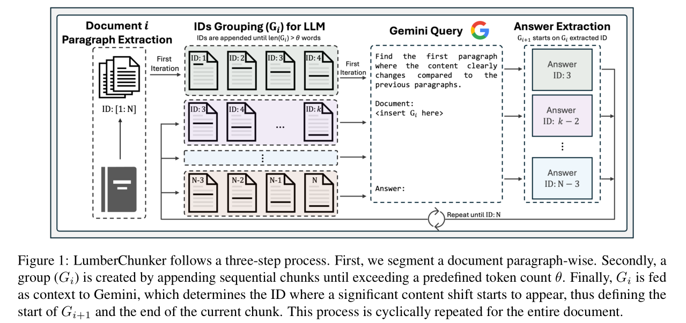
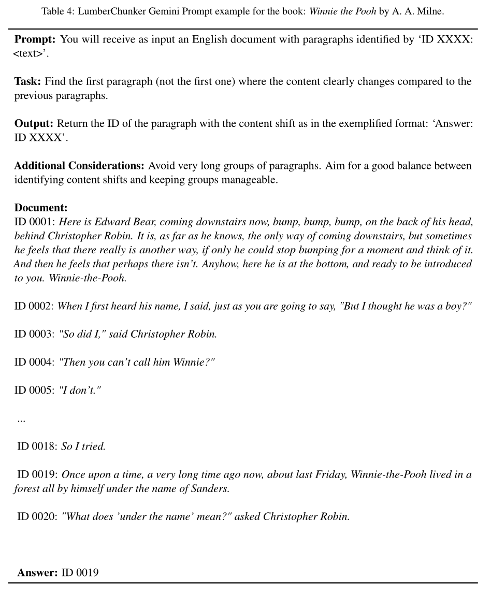
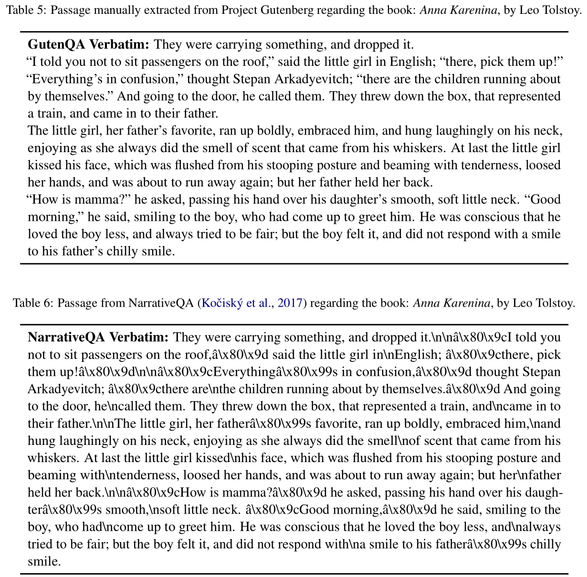
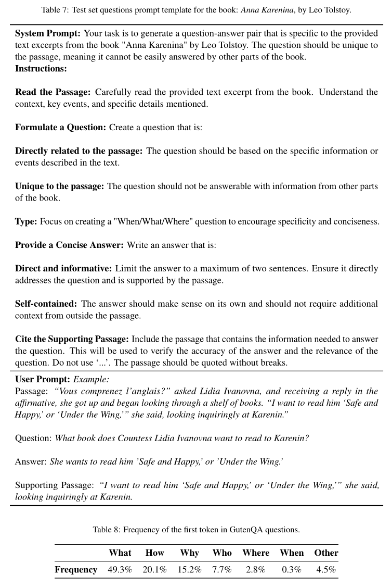
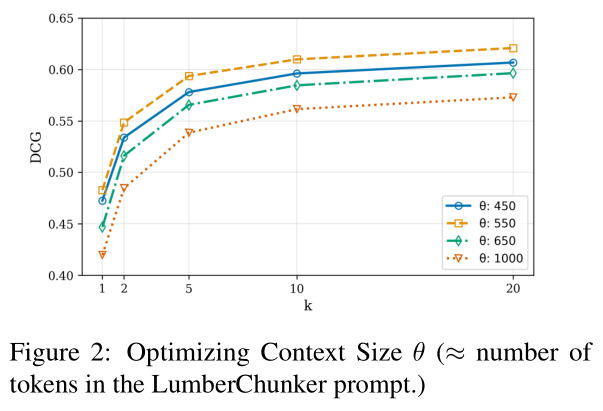
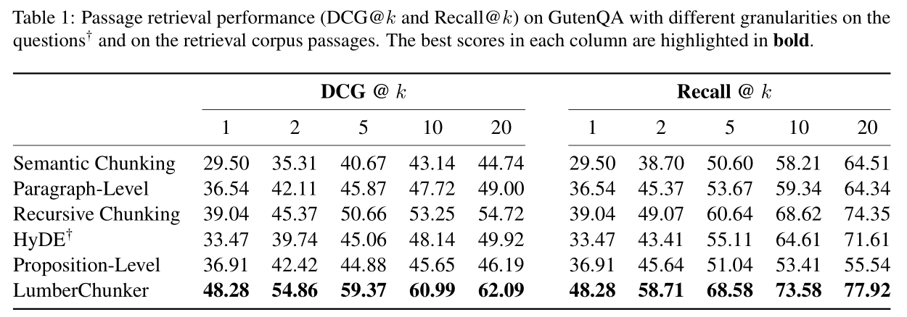
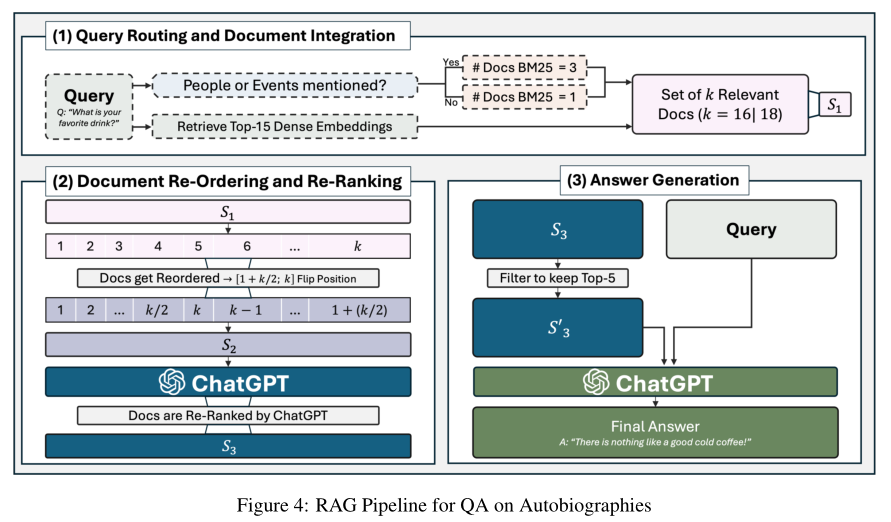
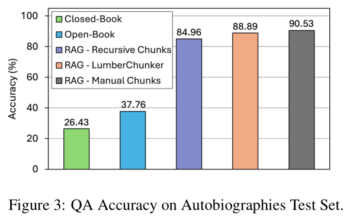
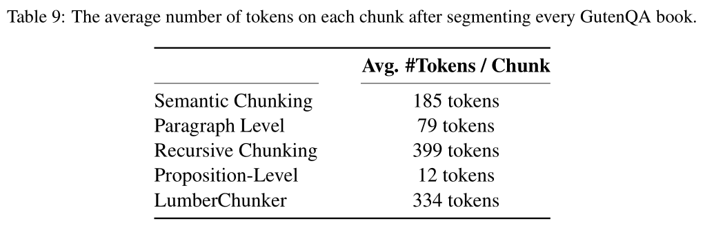
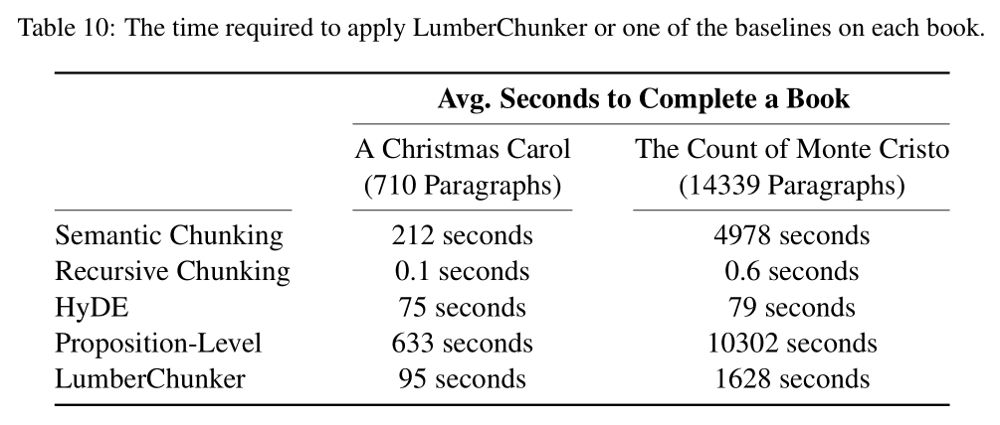

LumberChunker: Long-Form Narrative Document Segmentation

## 目录

- [内容](#内容)
- [方法介绍](#方法介绍)
  - [LumberChunker](#LumberChunker)
  - [GutenQA](#GutenQA)
- [实验](#实验)
  - [每个LumberChunker提示的目标token数阈值的最优值是多少？](#每个LumberChunker提示的目标token数阈值的最优值是多少)
  - [LumberChunker是否能提升检索效果？](#LumberChunker是否能提升检索效果)
  - [LumberChunker分块是否能提升生成质量？](#LumberChunker分块是否能提升生成质量)
  - [分块统计数据对比](#分块统计数据对比)
    - [分块数量](#分块数量)
    - [分块效率](#分块效率)
- [总结](#总结)

论文地址：[https://arxiv.org/pdf/2406.17526](https://arxiv.org/pdf/2406.17526 "https://arxiv.org/pdf/2406.17526")

项目地址：[https://github.com/joaodsmarques/LumberChunker](https://github.com/joaodsmarques/LumberChunker "https://github.com/joaodsmarques/LumberChunker")

## 内容

**研究主题**：文本分块

**研究动机**：

1. **现代NLP任务对检索方法的依赖**：现代NLP任务越来越依赖密集检索方法来获取最新且相关的上下文信息。然而，**传统的文档分割方法（如按句子、段落或命题分割）往往无法很好地捕捉内容的语义独立性**，从而影响检索效果。
2. **现有检索方法的局限性**：现有的检索方法在处理长篇叙事文档时，常常**因为文档分割不当而导致检索到的文档片段上下文不完整或包含过多无关信息，进而损害检索模型的性能**。
3. **“幻觉”问题**：当大型语言模型（LLMs）在生成响应时缺乏相关信息时，可能会产生“幻觉”，即生成看似合理但事实上错误的响应。这在一些对信息准确性要求极高的场景（如法律领域）中可能会带来严重的后果。

**研究现状**：

1. **文档分割的粒度问题**：文档分割的粒度对检索质量有重要影响。传统的分割方法包括基于句子、段落或命题的分割，但这些方法在处理叙事文本时可能会因为缺乏对文本结构和语义的理解而效果不佳。
2. **语义分割方法**：一些研究尝试利用嵌入向量来聚类语义相似的文本片段，通过识别嵌入距离的显著变化来确定分割点，从而确保每个片段都保持有意义的上下文和连贯性。
3. **命题级分割**：有研究提出了“命题”这一新的检索粒度，将文本分割成每个命题都传达一个独立事实的最小文本单元。然而，这种方法在叙事文本中可能效果不佳，因为叙事文本更注重文本的连贯性和上下文的连续性。
4. **查询调整方法**：除了文档分割，还有一些研究关注调整查询本身以提高检索效果，例如通过LLM将查询转换为潜在的答案文档。

**主要贡献**：

1. **提出LumberChunker方法**：LumberChunker是一种**基于LLM的动态文档分割方法，能够根据内容的语义独立性动态调整分割片段的大小**。该方法通过反复提示LLM识别一系列连续段落中内容开始发生变化的点，从而确定分割点，确保每个片段在上下文上是连贯的，同时与其他片段区分开来。
2. **创建GutenQA基准**：为了评估LumberChunker的效果，创建了一个名为GutenQA的基准数据集，包含从Project Gutenberg的100本公共领域叙事书籍中提取的3000个“针在草堆”类型的问答对。这些问答对专门设计为针对文档中特定的、不太可能在其他地方重复出现的信息，以评估检索能力。

## 方法介绍

### LumberChunker

LumberChunker是一种新型的文档分割方法，旨在通过动态分割文档来提高信息检索的效率和准确性。该方法的核心思想是利用大语言模型（LLM）的能力，将文档分割成语义独立的块，从而更好地捕捉内容的语义独立性。以下是LumberChunker方法的详细解读：

**核心理念**：

- **动态分割**：LumberChunker的核心在于**动态调整文档分割的粒度**。与传统的固定粒度分割方法（如按句子、段落或固定长度分割）不同，LumberChunker允许每个分割块的大小根据内容的语义独立性动态变化。这种动态性确保每个块都能封装一个完整、独立的概念，从而增强检索文档的相关性和清晰度。
- **利用LLM的能力**：LumberChunker**通过向LLM输入一组连续的段落，让LLM自主确定最合适的分割点。** LLM在处理文本时能够理解文本的结构和语义，因此能够更精准地识别内容的变化点，从而生成大小优化且上下文连贯的块。

**具体流程**：

1. **段落提取**：首先，将目标文档按段落拆分，每个段落被赋予一个唯一的递增ID编号。这样可以确保每个段落都能被准确地标识和引用。
2. **分组输入**：将这些段落按顺序连接成一个分组 $  G_i  $，直到该分组的总token数达到预设的阈值 $  \theta  $。阈值 $  \theta  $ 是根据经验策略性设置的，目的是在避免分割相关较大段落和防止模型因上下文过多而影响推理准确性之间取得平衡。
3. **模型判断**：将分组 $  G_i  $ 作为上下文输入给LLM（本研究中使用的是Gemini 1.0-Pro）。LLM的任务是确定 $  G_i  $ 中与前文内容显著变化的具体段落ID。**这个段落ID标志着一个块的结束，同时也是下一个分组 **$  G_{i+1}  $** 的起始点。**
4. **循环迭代**：对整个文档重复上述过程，直到所有段落都被分割完成。通过这种方式，文档被动态地划分为多个语义独立的块。

**提示词**：为了指导LLM完成分割任务，设计了专门的提示词。提示词的作用是明确告知LLM任务的目标，即识别内容显著变化的段落ID，从而确保模型能够准确地完成分割任务。

### GutenQA

为了评估LumberChunker方法的效果，创建了一个名为GutenQA的基准数据集。以下是关于GutenQA的详细解读：

**数据集构建**：

- **数据来源**：GutenQA数据集包含从Project Gutenberg手动提取的100本书籍。这些书籍涵盖了多种类型的叙事文本，为实验提供了丰富的语料。
- **手动提取**：由于Project Gutenberg中的书籍HTML结构多样，选择**手动提取内容**，以避免自动文本提取可能引入的错误。手动提取虽然耗时，但能够确保数据的准确性和完整性。

  表 5 和表 6 中的段落差异显著。后者段落存在错位的‘\n’字符和‘â’‘\x80\x9c’等非标准字符，可能是数据提取过程中编码问题导致的。相比之下，手动从 Project Gutenberg 提取的第一段更易读，且无此类错误。

  

**问题生成**：

- **问题类型**：为了评估LumberChunker的检索能力，使用ChatGPT（gpt-3.5-turbo-0125）为每本书生成问题。**生成的问题被设计为事实性和具体性问题**，针对文本中不太可能在其他部分重复出现的信息。这种设计策略更倾向于“什么”“何时”“何地”类问题，而非“为什么”和“如何”类问题，因为前者更有利于评估检索的准确性和精确性。
- **问题筛选**：最初自动生成了超过10,000个问题，然后通过筛选为每本书保留了30个高质量问题。筛选过程旨在确保问题的质量和多样性，同时避免重复和无关问题。
- **提示词**：用于指示模型生成问题的提示词以及数据集中问题类型分布的统计信息。

  

**数据集特点**：GutenQA数据集的特点是问题与文本内容紧密相关，且针对的是文本中独特的、具体的信息。这种设计使得数据集能够有效地评估文档分割方法在检索特定信息时的性能，尤其是在处理长篇叙事文本时的效果。

通过LumberChunker方法和GutenQA数据集，不仅提出了一种新的文档分割方法，还为评估该方法提供了一个高质量的基准。这种方法和数据集的结合为研究文档分割在信息检索中的作用提供了有力的支持。

## 实验

### 每个LumberChunker提示的目标token数阈值的最优值是多少？

- **实验设计**：分析不同提示长度 $\theta \in [450,1000]$ tokens对LumberChunker的检索性能（DCG\@k 和 Recall\@k）的影响。
- **目的**：确定最佳的token数阈值 $\theta$，以优化检索性能，同时**避免过长或过短的上下文对模型推理的影响**。
- **实验结果**：图2显示，当阈值 $\theta = 550$ 时，LumberChunker在所有测试的k值下均获得最高的DCG\@k分数。这表明550 tokens的提示在上下文捕捉和段落长度之间达到了最佳平衡。
- **分析**：

  **平衡的重要性**：阈值 $\theta = 550$ 的表现优于其他值，说明它既避免了过短的上下文（可能导致信息不完整），也避免了过长的上下文（可能导致模型难以聚焦于相关部分）。

  **其他阈值的表现**：$\theta = 450$ 和 $\theta = 650$ 表现相近但略低，说明它们虽然有效，但未能达到最佳平衡。而 $\theta = 1000$ 的表现最差，说明过长的上下文会显著影响模型的推理能力。
- **结论**：$\theta = 550$ 是最优的上下文规模，能够最大化检索性能。

  

### LumberChunker是否能提升检索效果？

- **实验设计**：使用GutenQA数据集中的问题，评估LumberChunker在定位高度特定信息时的表现，并将其与多种基线方法（如语义分块、段落级分块、递归分块和命题级分块）进行比较。
- **目的**：验证LumberChunker是否在检索任务中优于传统方法，尤其是在处理长篇叙事文本时。
- **实验结果**：表1显示，LumberChunker在所有k值下均优于所有基线方法，特别是在 $k = 20$ 时，LumberChunker的DCG分数达到62.09，而最接近的竞争对手递归分块仅为54.72；Recall\@k分数也表现出类似的趋势。
- **分析**：

  **LumberChunker的优势**：LumberChunker通过动态分割文档，能够更好地捕捉内容的语义独立性，从而在检索任务中表现出色。

  **基线方法的局限性**：
  - **段落级分块和语义分块**：这些方法在k值增大时表现不佳，说明它们在处理大量检索文档时难以保持相关性。
  - **HyDE**：尽管引入了额外的增强层，但其性能并未超越简单的递归分块，说明**其增强层可能不适用于此任务**。
  - **命题级分块**：在叙事文本中表现较差，因为**叙事文本更注重内容的流畅性和上下文连贯性**。
- **结论**：LumberChunker在检索任务中显著优于传统方法，特别是在处理长篇叙事文本时。

  

### LumberChunker分块是否能提升生成质量？

- **实验设计**：将LumberChunker分块集成到RAG流程中，并基于四本叙事性自传创建了一个包含280个问题的较小问答测试集。对比LumberChunker与其他RAG流程变体（包括手动分块、Gemini 1.5 Pro和闭卷设置）的问答准确率。

  
- **目的**：评估LumberChunker分块在问答任务中的实际应用效果，判断其是否能提升生成质量。
- **实验结果**：图3显示，LumberChunker在集成到RAG流程后，相比其他基线方法展现出更高的平均准确率。特别是在 $k = 20$ 时，LumberChunker的准确率显著高于递归分块，仅略低于手动分块的RAG方法。

  
- **分析**：

  **LumberChunker的优势**：LumberChunker通过优化文档分割，显著提升了检索质量，从而在问答任务中表现出色。

  **基线方法的局限性**：递归分块虽然在检索任务中表现出色，但在问答任务中仍不如LumberChunker，说明检索质量对问答任务的准确率有直接影响。

  **手动分块的黄金标准**：手动分块虽然表现最佳，但成本较高且难以大规模应用，LumberChunker在实际应用中具有更高的性价比。
- **结论**：LumberChunker不仅在检索任务中表现出色，还能显著提升问答任务的准确率，证明了其在实际应用中的价值。

### 分块统计数据对比

#### **分块数量**

**LumberChunker**：由于其动态分割的特性，生成的块数量会根据文档内容的变化而变化，但总体上能够保持块的独立性和连贯性。

**语义分割和段落级分割**：由于分割粒度较细，生成的块数量较多，导致每个块的上下文信息可能不足。

**递归分割**：生成的块数量适中，但块的大小固定，无法动态调整。

**命题级分割**：生成的块数量最多，但每个块的粒度过细，可能导致上下文信息丢失。

#### 分块效率

**LumberChunker**：虽然处理时间较长，但其动态分割方法在语义独立性和检索性能上具有显著优势。优化方向包括改进LLM性能、减少查询次数和引入并行处理。

**递归分割**：处理时间最短，但缺乏语义理解。适用于对效率要求极高的场景，但可能牺牲一定的语义分割精度。

**语义分割和命题级分割**：处理时间较长，但能够捕捉一定的语义信息。优化方向包括优化嵌入计算和简化聚类算法。

**HyDE**：处理时间适中，但分割粒度固定，灵活性较差。

## 总结

基于LLM实现文本分块的方法，不需要进行模型微调，仅通过提示词实现，整体代码实现相对比较容易，分块效果也比较不错，但是基于LLM进行文本分块的策略，分块时间仍是需要考虑提升的点。
