# Dense X Retrieval: What Retrieval Granularity Should We Use?

## 目录

- [内容](#内容)
- [方法介绍](#方法介绍)
  - [命题的定义与原则](#命题的定义与原则)
  - [命题的示例与优势](#命题的示例与优势)
  - [命题作为检索单元的优势](#命题作为检索单元的优势)
- [FACTOIDWIKI](#FACTOIDWIKI)
- [实验](#实验)
  - [评测数据集](#评测数据集)
  - [baseline](#baseline)
  - [段落检索评估](#段落检索评估)
    - [段落检索性能](#段落检索性能)
    - [更细粒度索引的检索 ⇒ 更好的跨任务泛化](#更细粒度索引的检索--更好的跨任务泛化)
    - [更高的段落召回率 ⇒ 更高的下游问答准确率](#更高的段落召回率--更高的下游问答准确率)
  - [检索增强语言模型的开放域问答评估](#检索增强语言模型的开放域问答评估)
    - [开放域问答性能](#开放域问答性能)
    - [更细粒度⇒更高的问题相关信息密度](#更细粒度更高的问题相关信息密度)
  - [案例分析](#案例分析)
- [总结](#总结)

论文地址：[https://arxiv.org/pdf/2312.06648](https://arxiv.org/pdf/2312.06648 "https://arxiv.org/pdf/2312.06648")

项目地址：[https://github.com/chentong0/factoid-wiki](https://github.com/chentong0/factoid-wiki "https://github.com/chentong0/factoid-wiki")

## 内容

**研究主题**：密集检索（Dense Retrieval）中检索单元的粒度选择问题

**研究动机**：在开放域 NLP 任务中，密集检索作为一种获取相关背景知识或上下文信息的重要方法，被广泛应用。然而，以往研究中**对于检索单元的选择往往较为固定**，例如使用固定长度的段落块或句子等，而这种选择对检索性能和下游任务表现的影响却未得到充分关注。此外，现有的检索单元（如段落或句子）可能存在一些不足，例如**段落可能包含过多无关细节**，**句子可能结构复杂且缺乏足够的上下文信息**，从而影响检索模型的准确性和效率。因此，研究者希望探索一种更优的检索单元粒度，以提升密集检索模型在检索和下游任务中的性能。

**研究现状**：目前，密集检索模型大多采用双编码器架构，将查询和文档分别编码为低维特征向量，通过计算向量之间的相似度来衡量相关性。然而，由于**相似度函数的表达能力有限，这类模型在面对新任务、尤其是训练数据稀缺的任务时，泛化能力较差**。为了解决这一问题，以往的研究尝试了多种方法，如数据增强、持续预训练、任务感知训练、混合稀疏 - 密集检索等，以提升密集检索模型的泛化性能。在检索单元的粒度方面，虽然有研究关注到段落和句子作为检索单元的局限性，但尚未有系统的研究来比较不同粒度检索单元对密集检索模型性能的影响，也缺乏一种更细粒度且有效的检索单元来替代传统的段落或句子。

**主要贡献**：

- **系统研究检索粒度的影响**：通过在五个不同的开放域问答（QA）数据集上进行实验，系统地研究了检索单元粒度（包括段落、句子和本文提出的命题）对检索性能和下游任务性能的影响，发现检索单元的选择对性能有显著影响，为后续研究提供了重要的参考依据。
- **提出命题作为新的检索单元**：首次将命题（proposition）引入作为密集检索的检索单元。命题被定义为文本中的原子表达，每个命题封装一个独立的事实，并以简洁、自包含的自然语言格式呈现。实验结果表明，基于命题的检索在检索任务和下游 QA 任务中均优于传统的段落和句子级别的检索，尤其是在泛化性能方面，对于未见过的下游任务数据集，命题级别的检索能够更好地提升检索模型的性能。
- **构建并开源 FACTOIDWIKI 数据集**：对英文维基百科进行了处理，将其页面分割成段落、句子和命题三种粒度的文本单元，并构建了相应的索引，形成了 FACTOIDWIKI 数据集。这一数据集为研究者提供了一个标准化的实验平台，便于后续研究在不同检索单元粒度下进行比较和验证，促进了相关研究的发展。

## 方法介绍

先来看一个同一检索器在三种不同粒度下检索到文本的例子：

段落作为一种较粗的检索单元，具有更长的上下文，理论上能够为问题提供更多相关信息。然而，段落通常包含无关的细节（例如表 1 示例中的修复时期和水平位移），这些细节可能会干扰检索器和下游任务中的语言模型。

句子级索引提供了一种更细粒度的方法，但并没有完全解决这个问题。因为句子仍然可能复杂且复合，并且它们通常不是独立的，缺乏判断查询 - 文档相关性所需的必要上下文信息（例如，在表 1 的示例中，“the tower” 是 “Pisa Tower” 的共指）。

细粒度检索单元能够提供更精确的信息，减少无关细节的干扰，同时保持足够的上下文信息，从而提升检索模型的准确性和效率。

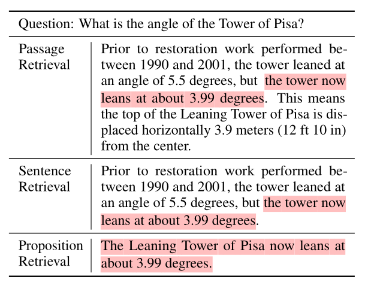

为了克服段落和句子级索引的局限性，本文提出将**命题（proposition）** 作为新的检索单元。

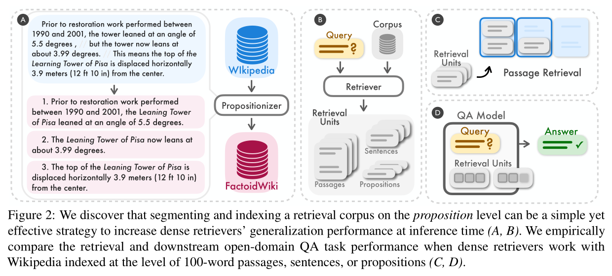

### 命题的定义与原则

命题指的是文本中**具有原子意义的表达形式**，每个命题封装一个独立的事实，并以简洁、自包含的自然语言格式呈现。命题的定义遵循以下三个原则：

1. **语义唯一性**：每个命题应对应文本中的一个独特意义片段，所有命题的组合应能代表整个文本的语义。例如，一个段落可以被拆分为多个命题，每个命题描述一个独立的事实。这些命题组合起来能够完整地表达段落的语义。
2. **不可分割性**：命题应是最小的语义单元，即它不能再进一步拆分为独立的命题。例如，如果一个句子可以被拆分为两个独立的事实，那么它应该被拆分为两个命题，而不是保留为一个复合命题。
3. **自包含性**：命题应具备上下文且自包含，包含文本中的所有必要上下文（如共指）以解释其含义。例如，如果一个句子中包含代词（如“它”），命题需要将代词解析为完整的实体名称，以确保命题可以独立于原文进行解释。

### 命题的示例与优势

为了更好地理解命题的概念，下面通过一个具体的例子展示了如何将一个段落拆分为一组命题。例如，关于比萨斜塔的段落可以被拆分为以下三个命题：

1. **修复前的角度**：比萨斜塔在修复前的角度是5.5度。
2. **当前角度**：比萨斜塔当前的角度是3.99度。
3. **水平位移**：比萨斜塔顶部水平位移3.9米。

这些命题不仅封装了段落的核心信息，还通过解析代词（如“塔”被解析为“比萨斜塔”）确保了每个命题的自包含性。这种细粒度的表达方式使得命题能够更精确地匹配查询需求，减少无关信息的干扰，同时保持足够的上下文信息。

### 命题作为检索单元的优势

将命题作为检索单元具有以下优势：

1. **更高的检索精度**：命题通过封装独立的事实，减少了无关信息的干扰，使得检索模型能够更精确地匹配查询需求。
2. **更好的上下文保持**：命题通过解析代词和添加必要的上下文信息，确保每个命题都能独立于原文进行解释，从而提供足够的上下文信息。
3. **更高的信息密度**：在相同的计算预算下，命题级别的检索能够提供更密集的与问题相关的信息，从而提高下游任务（如问答）的性能。

通过这些设计和验证，命题作为一种新的检索单元，为密集检索模型的性能提升提供了新的思路和方法。

## FACTOIDWIKI

为了验证命题（proposition）作为检索单元的有效性，本研究构建了一个处理过的英文维基百科转储数据集，称为 **FACTOIDWIKI**。该数据集将维基百科的每篇文档分割成三种不同的粒度：100词的段落、句子和命题。这一数据集的构建旨在实证比较不同粒度的检索单元对密集检索性能的影响。

- 数据集构建

  **FACTOIDWIKI** 使用了2021年10月13日的英文维基百科转储。研究者们通过以下步骤将维基百科页面分割成命题：
  1. **段落分割**：使用贪婪方法将段落分割成100词的块，确保每个段落块包含完整的句子。
  2. **句子分割**：使用 Python SpaCy 的 `en_core_web_lg` 模型将每个段落分割成句子。
  3. **命题生成**：通过微调一个文本生成模型（称为 **Propositionizer**），将段落分解成命题。该模型通过两步蒸馏过程训练：首先，**使用 GPT-4 生成包含命题定义和示例的提示**，生成段落到命题的种子数据集。然后，**使用这些种子数据对 Flan-T5-large 模型进行微调**。

     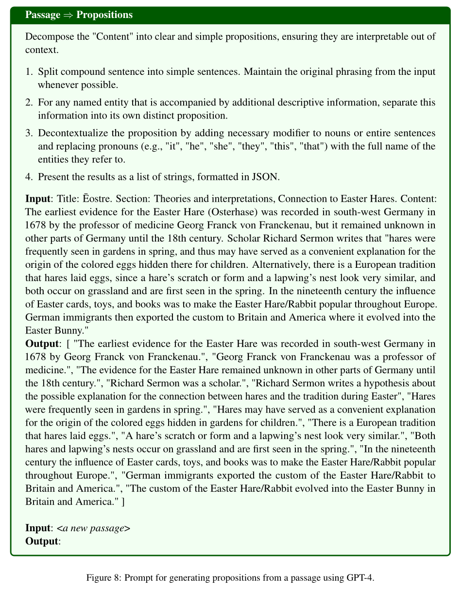
     最终，**FACTOIDWIKI** 包含了来自600万维基百科页面的文本，分割成2.57亿个命题。以下是数据集的统计数据：
  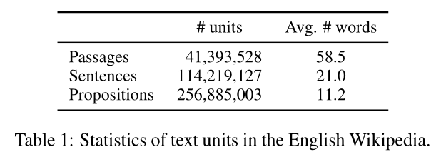
- 质量分析

  对 GPT-4 和 Propositionizer 生成的命题质量进行人工错误分析，估计了以下错误情况的频率：（1）命题未被段落完全支持；（2）命题可以进一步拆分为独立命题；（3）命题不自包含（表 2）。在随机抽取的 50 个段落中，观察到两种模型生成的**几乎所有命题都是忠实的，只有一小部分命题不是独立的**。证明数据集的高质量。

  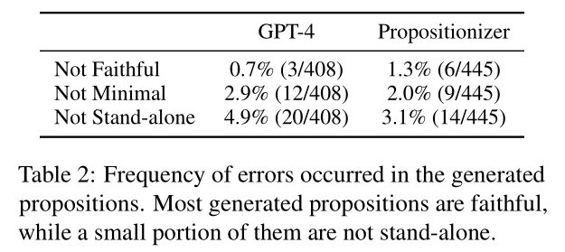

## 实验

### **评测数据集**

为了全面评估不同检索单元（段落、句子、命题）对密集检索和下游问答任务的影响，研究者们选择了五个具有代表性的开放域问答（QA）数据集，这些数据集均以维基百科作为检索源。具体数据集如下：

1. **自然问题（Natural Questions, NQ）**：由 Kwiatkowski 等人于 2019 年提出，包含大量自然语言形式的问题及其对应的维基百科段落答案。
2. **琐事问答（TriviaQA, TQA）**：由 Joshi 等人于 2017 年提出，包含各种琐事类问题及其答案，答案同样来源于维基百科。
3. **网络问题（Web Questions, WebQ）**：由 Berant 等人于 2013 年提出，问题来源于网络搜索，答案与维基百科内容相关。
4. **SQuAD（Stanford Question Answering Dataset）**：由 Rajpurkar 等人于 2016 年提出，包含基于维基百科文章的问题及其段落级答案。
5. **实体问题（Entity Questions, EQ）**：由 Sciavolino 等人于 2021 年提出，专注于与特定实体相关的问答，答案通常涉及长尾实体信息。

这些数据集涵盖了不同类型的问题和答案，能够全面评估检索模型在不同场景下的性能。

### **baseline**

选择四种流行的密集检索模型进行实验，这些模型分为有监督和无监督两类：

1. **SimCSE**：基于 BERT-base 的编码器。在从维基百科随机采样的未标注句子上进行训练，通过对比学习增强句子嵌入的语义表示。无监督模型，适用于没有标注数据的场景。
2. **Contriever**：基于 BERT-base 的编码器。通过从维基百科和网络爬取的数据中构建的段对进行对比训练。无监督模型，能够学习到更广泛的数据分布。
3. **DPR**：双编码器 BERT-base 模型。使用来自 NQ、TQA、WebQ 和 SQuAD 的问题-段落对标签进行微调。有监督模型，针对特定问答数据集进行了优化。
4. **GTR**：基于 T5-base 的编码器。在在线论坛问答数据上进行预训练，并在 MS MARCO 和 NQ 数据集上使用问题-段落对标签进行微调。有监督模型，适用于需要高精度的问答任务。

### 段落检索评估

为了**评估不同粒度索引对段落检索性能的影响**，设计了以下评估方法：

**检索设置**：对于句子和命题级别的检索，将段落的分数定义为查询与段落中所有句子或命题之间的最大相似度分数。在实际检索中，首先检索出稍多数量的文本单元，然后将每个单元映射回源段落，最终返回前 k 个唯一段落。

- **段落级别检索**：直接计算查询与段落向量之间的相似度。
- **句子级别检索**：计算查询与段落中每个句子向量之间的相似度，然后取这些句子相似度的最大值作为段落的分数。
- **命题级别检索**：计算查询与段落中每个命题向量之间的相似度，然后取这些命题相似度的最大值作为段落的分数。

**评估指标**：使用**段落召回率@k**（Passage Recall\@k）作为主要评估指标，定义为在前 k 个检索段落中找到正确答案的问题百分比。

**下游问答评估**：使用\*\*Fusion-in-Decoder（FiD）**模型从检索到的段落中提取答案。FiD 模型基于 T5-large 架构，并在 NQ 数据集上进行了训练。使用**精确匹配（Exact Match, EM）\*\*分数评估预测答案与 ground truth 的匹配程度，即预测答案与真实答案完全匹配的问题百分比。

#### 段落检索性能

表3显示了在五个开放域问答数据集上，四种密集检索模型（SimCSE、Contriever、DPR、GTR）在段落、句子和命题级别索引下的段落检索性能（Recall\@k）。

结果显示，对于无监督检索器SimCSE 和 Contriever，**命题级别的检索在所有数据集上均优于句子和段落级别检索**。平均 Recall\@5 提高了 +12.0 和 +9.3，相对提升分别为 35.0% 和 22.5%。对有监督检索器DPR 和 GTR，**命题级别的检索在某些数据集上略逊于段落级别检索，但在模型未见过的数据集上表现出显著优势**。例如，在 SQuAD 和实体问题（EntityQuestions）数据集上，命题级别的检索显著优于其他两种粒度，Recall\@5 提升了 25%（DPR）和 16%（GTR）。

总的来说，**无监督检索器（如 SimCSE 和 Contriever）在命题级别索引下表现更好**，可能是因为命题级别的索引能够**更精确地捕捉到与查询相关的信息**，减少了无关信息的干扰。有监督检索器（如 DPR 和 GTR）在训练数据集上表现较好，但**在未见过的数据集上，命题级别的索引能够更好地泛化**。这表明命题级别的索引在跨任务泛化方面具有优势。

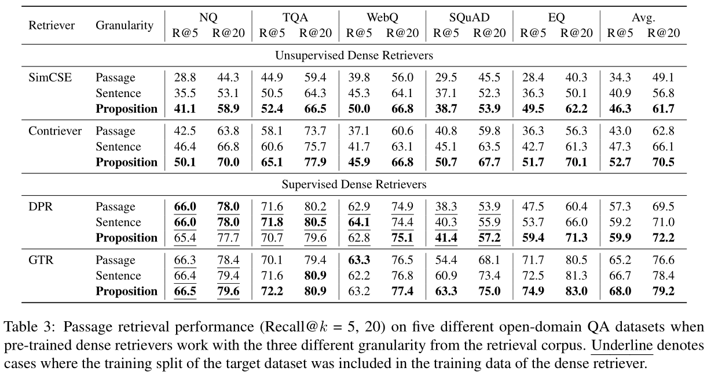

#### 更细粒度索引的检索 ⇒ 更好的跨任务泛化

为分析**命题级别的索引是否能够提高检索模型在未见过的数据集上的泛化能力**，特别是在处理长尾信息时的表现。在实体问题（EntityQuestions）数据集上，分析了不同粒度索引下的检索性能与目标实体出现频率的关系。

结果显示，对于不太常见的实体（频率值小于或等于 3），命题级别的检索表现出更大的优势。随着实体频率的增加，性能差距逐渐减小。

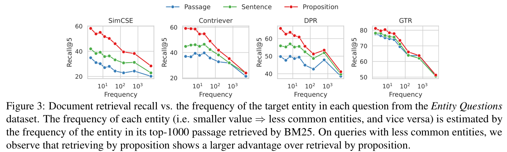

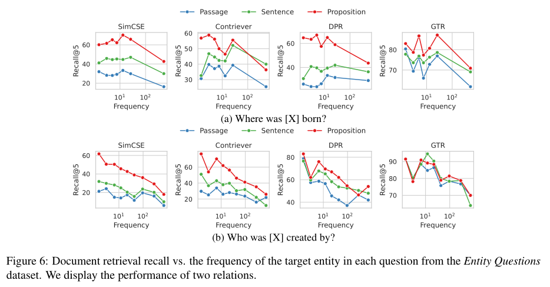

总的来说，命题级别的索引能够更好地处理长尾信息，因为每个命题封装了一个独立的事实，减少了无关信息的干扰。这种细粒度的索引方式在处理稀有或长尾实体时表现出显著优势，从而提高了检索模型的跨任务泛化能力。

#### 更高的段落召回率 ⇒ 更高的下游问答准确率

为了进一步了解**更细粒度索引的段落检索是否能实现更高的下游问答性能**，通过 QA 阅读器 Fusion-in-Decoder 从检索到的段落中提取答案。

结果显示，**命题级别的索引在所有四个检索器模型上均实现了最高的平均精确匹配**（EM）。除少数例外情况外，命题级别的索引在大多数检索任务和数据集上均实现了最高的 EM。下游问答性能的趋势与段落检索召回率高度一致，表明更高的段落召回率意味着更好的下游问答性能。

另外，从实验结果中可以看到，**更高的段落召回率意味着检索到的段落更有可能包含正确答案，从而提高了下游问答模型的准确率**。命题级别的索引通过减少无关信息的干扰，同时保持足够的上下文信息，使得下游问答模型能够更准确地提取答案，从而显著提升了整体性能。

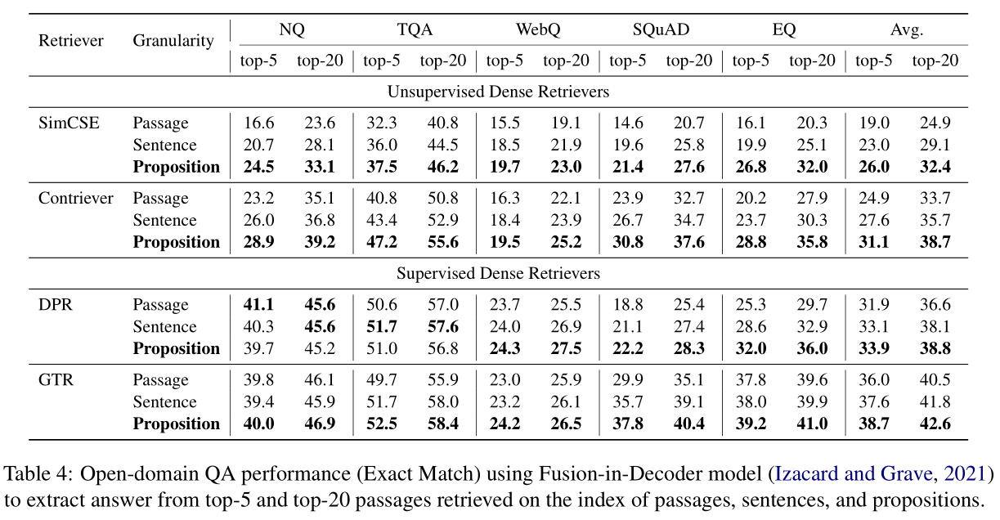

### 检索增强语言模型的开放域问答评估

为了进一步研究不同粒度检索单元对检索增强语言模型的影响，设计了以下实验：

1. **计算预算限制**：为了在相同的计算预算下公平比较不同粒度的检索单元，研究者们设置了检索到的标记（token）的最大数量上限为 l=100 或 500。只将段落、句子或命题级检索的前 l 个标记作为输入，馈送到语言模型中。
2. **评估指标**：使用**EM\@l 标记**作为评估指标，即在输入长度限制为 l 个标记的情况下，预测答案与 ground truth 完全匹配的问题百分比。
3. **语言模型选择**：使用**LLaMA-2-7B**模型进行评估，该模型在处理长文本时具有较好的性能。为了确保模型输出与每个数据集的格式一致，研究者们采用了上下文学习方法，纳入了四个示例演示。

#### 开放域问答性能

结果显示，在使用LLaMA-2-7B作为语言模型的实验中，**当使用命题作为检索单元时，基于EM\@l指标的问答性能显著高于使用段落或句子**。具体来说，使用命题而非段落时，四个密集检索器（SimCSE、Contriever、DPR和GTR）的EM\@500分数分别提高了+4.1、+3.2、+2.7和+2.8，而使用句子时的提升则较小，分别为+2.4、+2.1、+2和+1.6。

命题级别的检索通过提供更细粒度的信息单元，使得检索到的内容更紧密地围绕查询问题展开，从而在有限的输入长度内提供了更丰富的相关信息，进而提升了问答性能。表明在检索增强语言模型中，使用**更细粒度的检索单元能够更有效地利用有限的计算资源，提高模型的问答能力**。

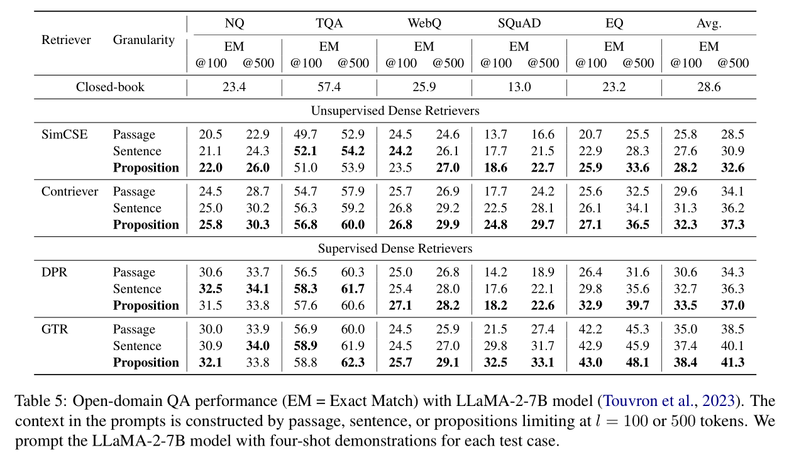

#### 更细粒度⇒更高的问题相关信息密度

为分析不同粒度的检索单元在检索到的前l个单词中包含问题相关信息的密度，以验证更细粒度的检索是否能够提供更高密度的相关信息，从而解释其在问答性能上的优势。实验通过**计算 GTR 在使用三种不同粒度索引的维基百科时，黄金答案在初始 l 个检索单词内的召回率**。

结果显示，命题检索的成功率高于句子和段落检索方法。在100-200个单词的范围内，命题检索相对于段落检索的召回率提升最为显著，这大致对应于约10个命题、5个句子或2个段落。随着单词数量的增加，三种粒度的召回率趋于收敛。

可以得到结论，**命题级别的检索由于其细粒度的特性，能够更精确地匹配查询问题**，使得检索到的前l个单词中包含更高密度的相关信息。这解释了为什么在相同的计算预算下，命题级别的检索能够带来更好的问答性能。**细粒度的检索单元使得检索结果更聚焦于问题的核心内容，减少了无关信息的干扰**，从而提高了检索增强语言模型的效率和准确性。

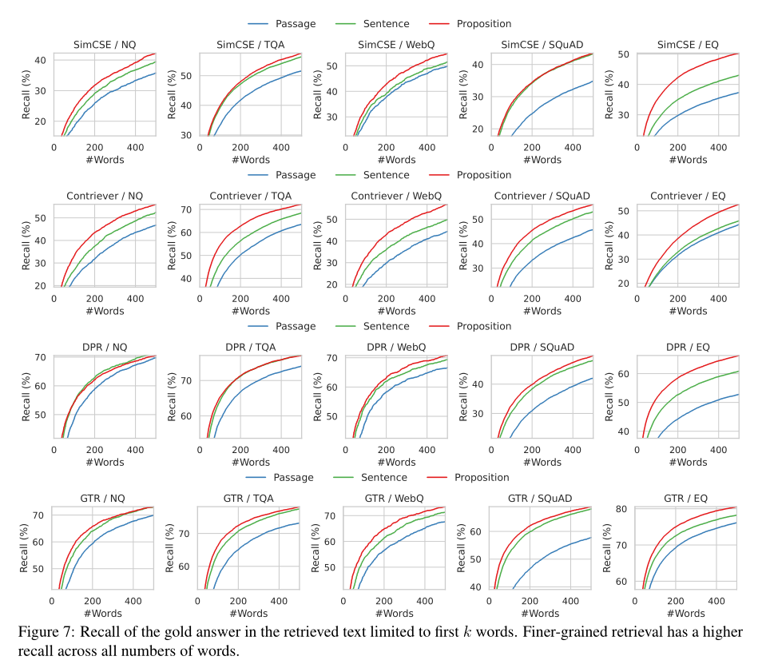

### 案例分析

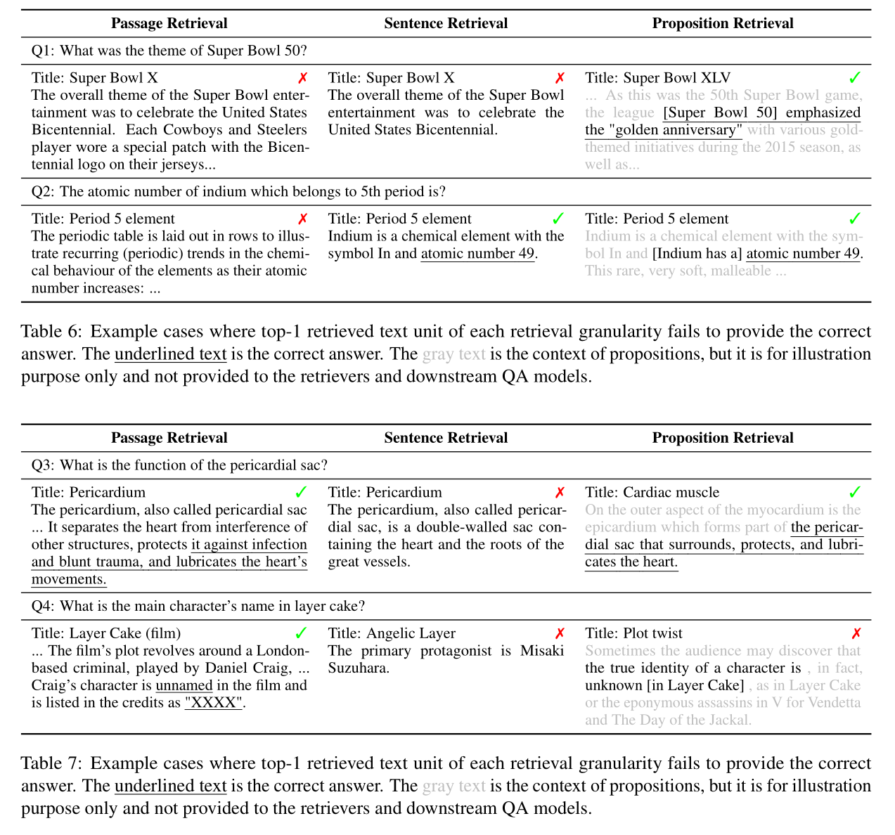

## 总结

**意义**：

**难点**：

**本文的思考**：
