# Meta-Chunking: Learning Efficient Text Segmentation via Logical Perception

## 目录

- [内容](#内容)
- [方法介绍](#方法介绍)
  - [方法设计](#方法设计)
    - [困惑度分块](#困惑度分块)
    - [边际采样分块](#边际采样分块)
    - [动态合并策略](#动态合并策略)
    - [Meta-Chunking 的语义补全](#Meta-Chunking-的语义补全)
  - [PPL 分块的理论分析](#PPL-分块的理论分析)
    - [交叉熵与 KL 散度](#交叉熵与-KL-散度)
    - [PPL的定义](#PPL的定义)
    - [熵的近似与上下文长度](#熵的近似与上下文长度)
- [实验](#实验)
  - [数据集和评估指标](#数据集和评估指标)
  - [baseline](#baseline)
  - [结果](#结果)
    - [主要结果](#主要结果)
    - [语义完整性增强的有效性](#语义完整性增强的有效性)
    - [指令遵循能力的影响](#指令遵循能力的影响)
    - [重叠分块策略的影响](#重叠分块策略的影响)
- [总结](#总结)

论文地址：[https://arxiv.org/abs/2410.12788](https://arxiv.org/abs/2410.12788 "https://arxiv.org/abs/2410.12788")

项目地址：[https://github.com/IAAR-Shanghai/Meta-Chunking](https://github.com/IAAR-Shanghai/Meta-Chunking "https://github.com/IAAR-Shanghai/Meta-Chunking")

## 内容

**研究主题**：一种新的文本分块策略

**研究动机**：

在 RAG 系统中，文本分块是将长文本分割成多个小块以便于检索和生成的关键步骤。然而，现有的分块方法（如基于规则或语义相似性的方法）存在以下问题：

1. **无法捕捉句子之间的逻辑关系**：传统方法仅基于语义相似性，难以识别句子之间的因果、过渡、并列等深层逻辑关系，可能导致重要信息的丢失。
2. **效率和性能问题**：一些基于大型语言模型（LLM）的分块方法（如 LumberChunker）虽然效果较好，但对模型的指令跟随能力要求高，计算资源消耗大，难以在实际场景中广泛应用。
3. **缺乏灵活性**：现有方法在处理不同复杂度的文本时，难以平衡细粒度和粗粒度分块的需求。

**研究现状**：

1. **文本分块方法**：
   - **基于规则的方法**：简单地将文本按固定长度分割，不考虑句子结构，可能导致信息碎片化。
   - **基于语义相似性的方法**：通过计算句子嵌入向量的相似度来分块，但难以捕捉逻辑关系。
   - **基于 LLM 的方法**：如 LumberChunker，利用 LLM 的推理能力预测分块点，但对模型能力和资源要求高。
   - **其他方法**：如 Dense X Retrieval 提出的“命题”（Proposition）作为新的检索粒度，适用于事实性文本，但在叙事性文本中效果不佳。
2. **RAG 系统中的文本分块**：
   - 文本分块对 RAG 系统的性能至关重要，无效的分块策略可能导致上下文不完整或引入过多无关信息，从而降低问答系统的性能。
   - 现有的分块策略主要集中在句子或段落级别，但这些方法在处理复杂文本时存在局限性。

**主要贡献**：

1. **提出 Meta-Chunking 概念**：定义了一种新的文本分块粒度——Meta-Chunking，介于句子和段落之间，能够捕捉句子之间的深层逻辑关系，提高文本分块的逻辑连贯性。
2. **设计 PPL Chunking 方法**：
   - 利用语言模型的困惑度（PPL）来识别文本块的边界。通过分析 PPL 分布的特征，找到文本逻辑结构的自然分界点，从而实现高效的文本分块。
   - 该方法降低了对模型规模的依赖，使得较小的语言模型也能有效地完成分块任务，同时提高了处理效率，节省了计算资源。
3. **动态合并策略**：提出了一种结合 PPL Chunking 和动态合并的策略，以平衡细粒度和粗粒度分块的需求。通过先进行细粒度分块，再根据用户指定的块长度进行合并，能够灵活适应不同的应用场景。

**项目地址：**[https://github.com/IAAR-Shanghai/Meta-Chunking](https://github.com/IAAR-Shanghai/Meta-Chunking "https://github.com/IAAR-Shanghai/Meta-Chunking")

## 方法介绍

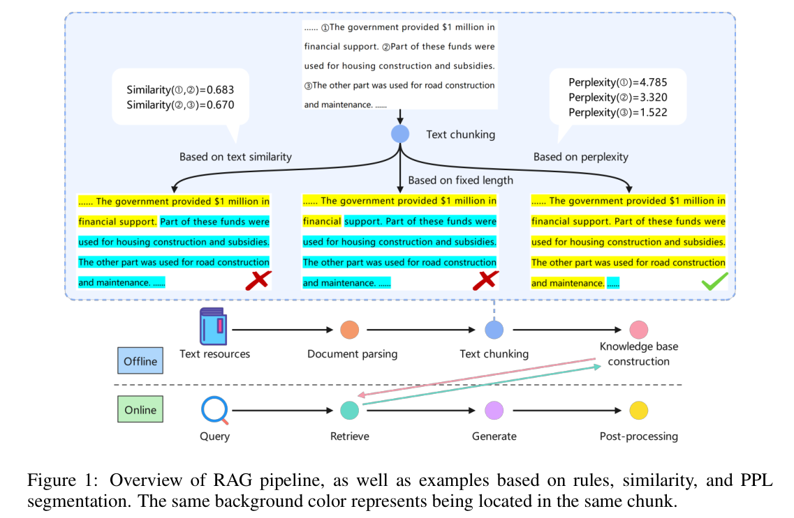

如图所示，示例句子展示了递进关系，但它们的语义相似性较低，这可能导致它们被完全分割开。本文提出**Meta-Chunking**的概念，结合了传统文本分割策略的优势，例如遵守预设的块长度约束和确保句子结构的完整性，同时增强在分割过程中保证逻辑连贯性的能力。它在句子和段落之间的粒度上操作，通过利用大型语言模型（LLMs）的能力，将文档灵活地分割成逻辑连贯的独立块。

### 方法设计

Meta-Chunking 的文本分块方法基于一个核心原则：**允许分块大小的动态变化，以更有效地捕捉和保持文本内容的逻辑完整性。**这种方法通过**动态调整分块的粒度，确保每个分割后的文本块（称为 Meta-Chunk）包含完整且独立的思想表达，从而避免在分割过程中打断逻辑链**。这不仅提高了文档检索的相关性，还提升了内容的清晰度。

Meta-Chunking 的关键在于引入了一个介于句子级和段落级文本粒度之间的新概念：**元块（Meta-Chunk）**。一个元块由段落内按顺序排列的句子集合组成，这些句子不仅具有语义相关性，更重要的是包含深层的语言逻辑联系，例如因果、过渡、并列和递进关系。这些关系超越了单纯的语义相似性。

为了实现上述目标，Meta-Chunking 提出了两种基于不确定性的自适应分块技术：**困惑度分块（Perplexity Chunking）**和**边际采样分块（Margin Sampling Chunking）**，并结合动态合并策略以满足多样化的分块需求。

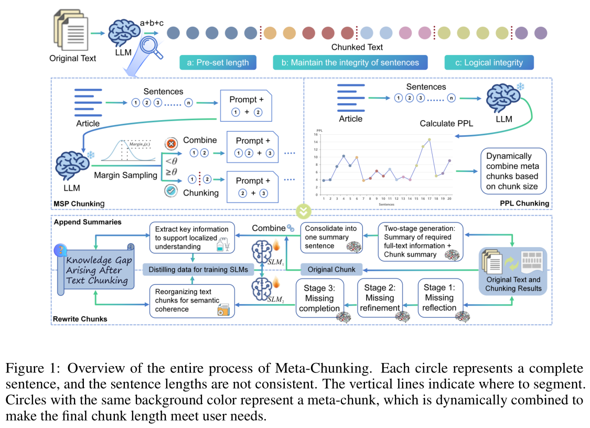

#### **困惑度分块**

困惑度（Perplexity, PPL）是衡量语言模型对文本序列的惊讶程度的指标，间接反映了句子之间的逻辑关系强度。

1. **文本分割与 PPL 计算**：

   给定一段文本，首先将其分割为句子集合$(x_1,x_2,\ldots,x_n)$。使用语言模型计算每个句子$x_i$的困惑度（PPL），公式如下：

   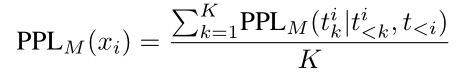

   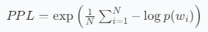

   其中：K表示句子$x_i$中的总词元数$t^i_k$表示句子$x_i$中的第k个词元；$t^i_{<k}$表示句子$x_i$中第k个词元之前的所有词元；$t_{<i}$表示句子$x_i$之前的所有词元。
2. **识别分块边界**：分析 PPL 序列$PPL_{seq} = (PPL_M(x_1), PPL_M(x_2), \ldots, PPL_M(x_n))$的分布特征，特别是识别最小值。最小值的识别条件如下：**当某一点两侧的 PPL 值都高于该点的 PPL 值，并且至少一侧的差异超过预设阈值θ，或者当左侧点与该点的差异大于θ且右侧点等于该点的 PPL 值**。这些最小值被视为潜在的分块边界。

   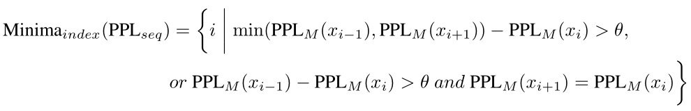
3. **处理长文本**：如果文本超出 LLMs 或设备的处理范围，引入键值（KV）缓存机制。具体来说，首先根据词元将文本分成若干部分，形成多个子序列。随着 PPL 计算的进行，**当 GPU 内存即将超过服务器配置或 LLMs 的最大上下文长度时，算法会适当移除之前部分文本的 KV 对，从而不会牺牲太多的上下文连贯性**。

#### 边际采样分块

边际采样分块（MSP）策略通过**分析模型决策过程中的边际概率分布来确定是否进行分块**。该方法的核心是计算模型对分割判断的两种选择（$k_1$“是”或$k_2$“否”）之间的概率差异（Margin）：

$$
Margin_{M}(x_{i})=P_{M}\left(y=k_{1} \mid \operatorname{Prompt}\left(x_{i}, X^{\prime}\right)\right)-P_{M}\left(y=k_{2} \mid \operatorname{Prompt}\left(x_{i}, X^{\prime}\right)\right)
$$

其中：$(k_1,k_2)$表示在分割判断中选择“是”或“否”的二元决策；$Prompt(x_i,X^′)$表示在$x_i$和$X^′$之间形成一个指令，关于它们是否应该合并，其中$X^′$包含单个句子或多个句子。

通过模型M获得的概率$P_M$，可以得出两个选项之间的概率差异$MarginM(x_i)$。通过将$MarginM(x_i)$与阈值θ进行对比，可以得出是否应该对这两个句子进行分割的结论。为了更灵活地调整分块，引入了动态阈值机制。初始时，$\theta$ 被设置为 0，随后通过跟踪历史 $Margin_M(x_i)$ 值并计算它们的平均值来微调 $\theta$。

#### **动态合并策略**

为了满足用户多样化的分块需求，仅通过调整阈值来控制块大小有时会导致块大小不均匀。提出了一种结合 Meta-Chunking 与动态合并的策略：

首先，根据 PPL 分布设置初始阈值为 0 或特定值，并执行 Meta-Chunking 操作，初步将文档分割为一系列基本单元$(c_1, c_2, \ldots, c_\alpha)$。

随后，根据用户指定的块长度L，迭代合并相邻的元块，直到总长度满足或接近要求。

具体来说，如果$len(c_1,c_2,c_3)=L$或$len(c_1,c_2,c_3)<L$而$len(c_1,c_2,c_3,c_4)>L$，则将$c_1,c_2,c_3$视为一个完整块。

#### Meta-Chunking 的语义补全

**问题背景** &#x20;

文本分块过程中，由于上下文信息的丢失，可能会导致语义鸿沟问题。为了解决这一问题，Meta-Chunking 提出了一种**全局增强的文本重写和摘要生成机制**，以修复分块造成的语义不连续性。

- 全局增强的文本块重写

  **预处理（可选）**：对于极长的文档，采用基于语义嵌入的块间相关性分析。通过语义相似性模型为每个块生成向量表示，并计算这些向量之间的余弦相似度，以识别与当前块相关的潜在上下文信息。

  **阶段 1（缺失反思）**：利用 LLM 对每个块进行深入的反思分析，明确识别当前块缺少哪些前提、背景、相关事实或结论性陈述。LLM 会全面列出信息缺失的领域，并指定需要补充的信息。

  **阶段 2（缺失细化）**：对前一阶段检测到的潜在缺失信息进行评分和过滤，以防止引入不相关或错误的补充内容，从而确保增强过程的准确性。

  **阶段 3（缺失补全）**：对于前一阶段细化的遗漏位置和确认的必要信息，将这些信息片段与当前文本块整合，生成一个上下文无缝、语义自然的新块。
- 上下文感知的摘要生成

  为每个文本块生成一个简洁的、富含全局信息的摘要，以增强块的上下文感知能力。具体方法包括：
  1. 利用全局信息为目标文本块生成补充摘要，补偿由于分割而可能导致的背景和关系信息的缺失。
  2. 独立生成一个概括文本块核心观点的局部摘要，然后将两个摘要融合并精炼为一个增强的摘要句子。
     **训练数据与微调** &#x20;
  为了支持重写和摘要生成组件，为每个组件构建了 20,000 个训练数据样本，并对小型语言模型（SLM）进行全量微调。损失函数定义为：
  $$
  L(\theta) = -\frac{1}{N} \sum_{t=1}^T \log P(y_t | y_{<t}, X; \theta) 
  $$
  其中，$P(y_t | y_{<t}, X; \theta)$ 是模型在给定输入 $X$ 和先前生成的前缀 $y_{<t}$ 的情况下，预测真实目标标记 $y_t$ 的概率，$\theta$ 是模型参数，$N$ 是一个批次中的样本数量。

### PPL 分块的理论分析

#### 交叉熵与 KL 散度

LLMs 旨在从样本文本中学习一个近似于经验分布P的分布Q，交叉熵是衡量两个概率分布差异的常用工具，在语言模型的上下文中，交叉熵用于量化模型分布 Q 与真实分布 P 之间的差异。在离散情况下，Q相对于P的交叉熵定义如下：

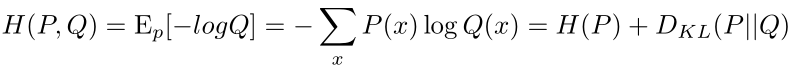

其中：$H(P)$表示经验熵。$D_{KL}(P∥Q)$是Q和P之间的 Kullback-Leibler（KL）散度。

#### PPL的定义

PPL（Perplexity）是语言模型性能的一个重要指标，LLMs 的 PPL 在数学上定义为：

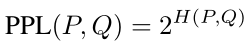

需要注意的是，由于H(P)表示真实分布的熵，是一个固定的值，是不可优化的且有界，真正影响不同 LLMs 之间 PPL 计算差异的是 KL 散度。KL 散度越大，两个分布之间的差异越大。此外，**高 PPL 表示 LLMs 对真实内容的认知幻觉，这些部分不应被分割**。

#### 熵的近似与上下文长度

Shannon（1951）通过函数近似任何语言的熵：

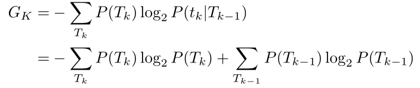

其中，$T_k$表示文本序列中的k个连续词元$(t_1,t_2,…,t_k)$，熵可以表示为：

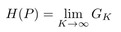

并且根据证明，$G_{K+1} \leq G_K$对于所有K≥1，可以推导出：

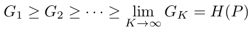

结合公式$H(P,Q)$，可以观察到，对于大规模文本处理任务，增加上下文长度往往会减少交叉熵或 PPL。这一现象反映了语言模型在捕捉更广泛的上下文信息后能够进行更有效的逻辑推理和语义理解。**因此，在 PPL 分块实验中，作者最大化输入到语言模型的较长文本序列，以期获得更显著的性能提升。**

## 实验

### **数据集**和评估指标

- **LongBench 基准测试**：包含三个英文数据集（2WikiMultihopQA、Qasper、MultiFieldQA-en）和一个中文数据集（MultiFieldQA-zh）。这些数据集涉及单跳和多跳问答任务，评估指标包括 F1 分数和分块时间。
- **CRUD 基准测试**：这是一个新型的 RAG 系统评估基准，包含单跳、双跳和三跳问题，使用 BLEU 系列、ROUGE-L 和 BERTScore 作为评估指标。

进行问答时，系统需要从向量数据库中进行密集检索，CRUD 的 top\_k 设置为 8，LongBench 的 top\_k 设置为 5。

### **baseline**

1. **基于规则的分块**：

   **原始方法**：简单地将长文本分割为固定长度的块，不考虑句子边界。

   **Llama\_index方法**：
   - **特点**：在保持句子边界的同时，确保每个段落的词元数量接近预设的阈值。
   - **实现**：使用 SimpleNodeParser 函数，通过调整 chunk size 参数来控制分块长度，并通过 chunk overlap 参数动态处理重叠部分。
2. **动态分块**：

   **相似性分块**：
   - **特点**：利用句子嵌入模型计算句子之间的余弦相似度，通过设置相似度阈值来选择分割点，将高度相关的句子分组在一起。
   - **实现**：使用 SemanticSplitterNodeParser 函数，对于英文文本使用 bge-large-en-v1.5 模型，对于中文文本使用 bge-base-zh-v1.5 模型。
     **Dense X Retrieval**：
   - **特点**：引入了一种称为命题的新检索粒度，通过训练信息提取模型来压缩和分割文本。
     **LumberChunker**：
   - **特点**：利用 LLMs 预测文本中的最佳分割点。
   - **问题**：在应用于较小模型时遇到困难，难以在不同模型之间进行比较。

### **结果**

#### 主要结果

实验结果表明，Meta-Chunking 在性能和处理时间上均优于传统的基于规则和语义相似性的分块方法，以及最先进的 LumberChunker 方法。具体表现如下：

- **MSP 分块**：表现出更稳定和改进的性能，尤其是在多跳问答任务中，能够更好地捕捉文本的逻辑结构。然而，该方法的处理时间与 LumberChunker 算法相似，两者都达到了实际应用中难以接受的阈值范围，突显了 LLMs 在处理分块任务时的低效性。
- **PPL 分块**：在平衡性能和处理时间方面表现出优势，尤其是在较小规模的模型（如 Qwen2-0.5B）上，能够实现与大规模模型（如 Qwen2-7B）相当的性能，同时显著减少了处理时间。与Margin Sampling 分块相比，在处理效率上实现了与动态分块策略相比的显著飞跃。在基础模型和指令模型之间的深入比较中，该方法缓解了当前文本分块严重依赖强指令遵循能力的困境，可以与 0.5B 的小型语言模型（SLM）集成而不会导致显著的性能下降。

**较弱的 LLMs 能有多弱？** 随着模型规模的减小，文本分块任务的执行时间显著减少，反映了小模型在提高处理效率方面的优势。此外，**PPL方法在模型规模减小时并未出现显著的性能下降，并且在大多数数据集上优于基线方法**，这进一步证明了我们方法的优越性。

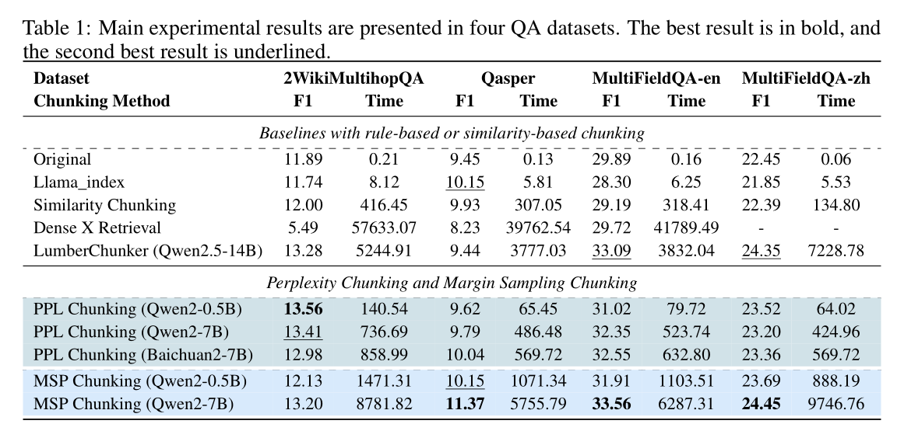

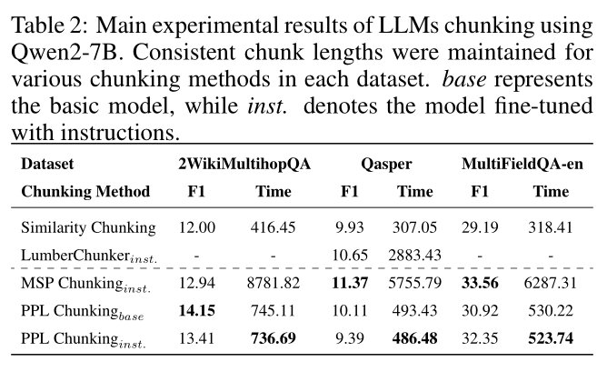

#### 语义完整性增强的有效性

通过在 CRUD 基准测试上的实验，验证了 Meta-Chunking 框架在分块基础上进一步增强了系统的整体性能。具体表现在：

- **文本块重写**：经过**重写后的文本块在与查询意图的对齐方面表现更好，从而促进了与问题高度相关的优质内容的获取**。例如，在 CRUD 数据集上，经过重写和总结生成的文本块在 BLEU 系列、ROUGE-L 和 BERTScore 等指标上均优于原始分块方法。

  文本块重写性能提升的原理：

  如表 5 所示，通过计算 Top-8 检索块与查询的平均相似度得分，比较了两种不同语义检索器下不同类型文本块的表现。结果表明，**重写后的块与查询意图的一致性更好，从而有助于获取与问题高度相关的内容。** 此外，如图 5 的实验所示，重写后的块在不同 LLM 下的 PPL 值始终更低。这一现象证明，**全局增强机制通过优化上下文连贯性，使 LLM 能够更好地理解检索到的文本**。

  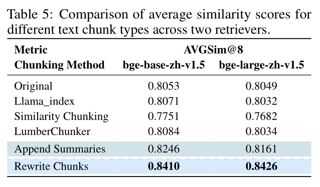

  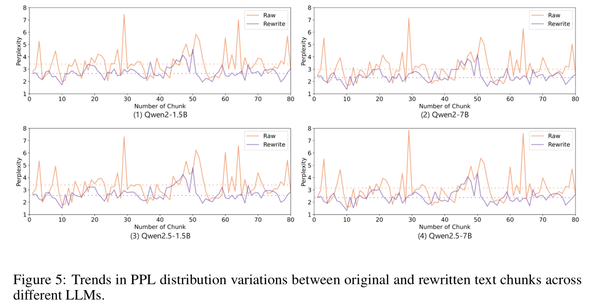
- **摘要生成**：通过**上下文感知的摘要生成，进一步提高了文本块的全局信息覆盖率**，为最终提高问答性能奠定了坚实基础。

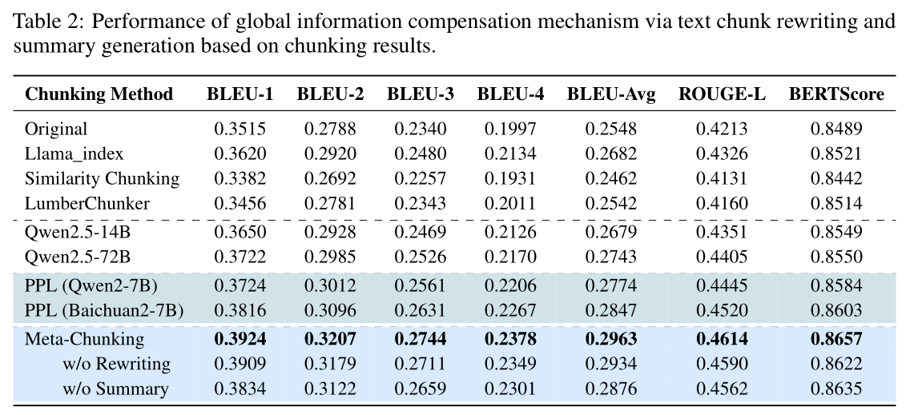

#### 指令遵循能力的影响

实验还探讨了模型的指令遵循能力对分块性能的影响。结果表明，PPL 分块对模型的推理能力要求更高，而 MSP 分块则更依赖于指令的精确性。例如，在使用不同规模的 LLM 时，**PPL 分块的性能相对稳定，而 MSP 分块的性能则受到指令设计的影响**。

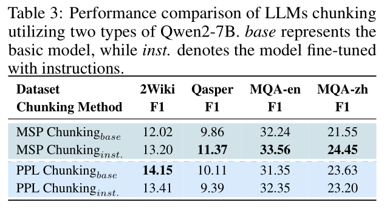

为 MSP 分块设计了两种提示：常规提示和更精确的提示。从图 2 可以看出，较小的模型可以从更精确的提示中受益，而较大的模型在使用精确提示时可能会出现性能下降。

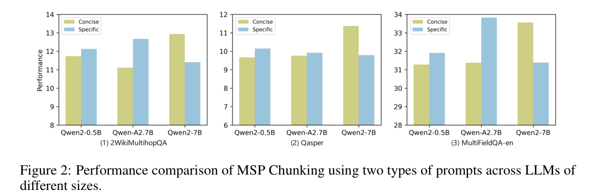

#### 重叠分块策略的影响

1. **重叠分块方法**：
   - **原始方法**：使用固定数量的字符从一个块的末尾与下一个块的开头重叠。
   - **Llama\_index 方法**：在此基础上还考虑了句子的完整性。
   - **PPL 分块方法**：**动态地将由 PPL 最小值点表示的句子分配给前一个和后续块，从而实现动态重叠。** 这些方法通常产生的重叠长度平均约为 50 个中文字符。
2. **实验结果**：表3所示，PPL 分块的重叠策略在多跳 QA 场景中表现出特别显著的效果。在单跳任务上，PPL 分块的重叠方法实现了 2%-3% 的性能提升（除了 BERTScore 指标）。双跳和三跳任务中，尽管改进速度略有放缓，但仍保持了 0.3%-1% 的持续增益。所有三个模型的性能随着模型参数规模的增加而呈现上升趋势。尽管 1.5B 模型在整体性能上略逊于 7B 模型，但它仍然比传统分块方法表现出显著的改进，进一步验证了 PPL 分块的有效性。结果表明，**PPL 分块的动态重叠策略能够更有效地桥接文本块之间的语义连接，从而在多个评估指标上实现性能提升**。

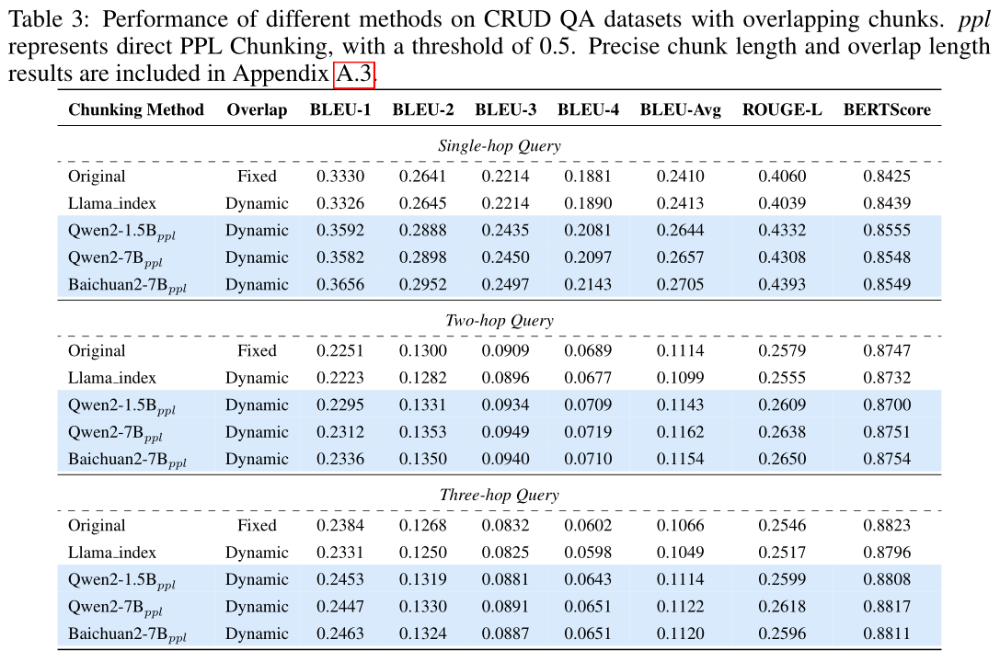

**两种 PPL 分块策略的比较分析**

1. **直接 PPL 分块**：直接根据 PPL 分布进行分块，可能导致块过长。
2. **动态组合的 PPL 分块**：通过动态组合的方式，有效地保持了块长度和逻辑一致性。
3. **实验结果**：如图3所示，动态组合的 PPL 分块方法在 CRUD 数据集上表现出更优越的性能。**与传统分割方法相比，PPL 分块在 BLEU 系列指标和 ROUGE-L 上实现了显著的性能提升，表明PPL方法提高了生成文本与参考文本之间的准确性和流畅性。** Qwen2-1.5B 和 Baichuan2-7B 在该评估框架下的表现非常接近，并且在多个指标上经常超过 Qwen2-7B 模型。

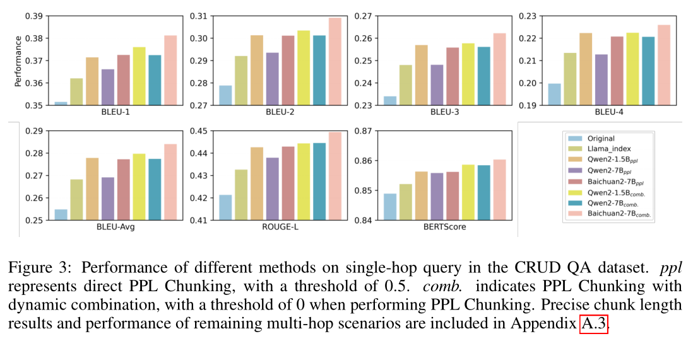

**长文本分块与策略选择**

1. **KV 缓存机制**：在处理较长文本时，采用 KV 缓存机制在保持连贯性的前提下计算句子的 PPL 值，从而优化 GPU 内存的利用率和计算精度。
2. **实验结果**：Qwen2-1.5B 和 Baichuan2-7B 表现出相当的性能，这进一步证实了 1.5B 模型在处理不同长度文本分块时能够在性能和效率之间保持令人印象深刻的平衡。
3. **PPL 分块的阈值选择**：对 LongBench 中的四个长文本 QA 数据集进行了深入的分块探索，并对 PPL 分块的阈值进行了梯度实验（0 到 0.4，步长 0.1）。当分块长度较小时，直接 PPL 分块带来了更大的收益；而当分块长度较长时，动态组合的 PPL 分块表现更好。

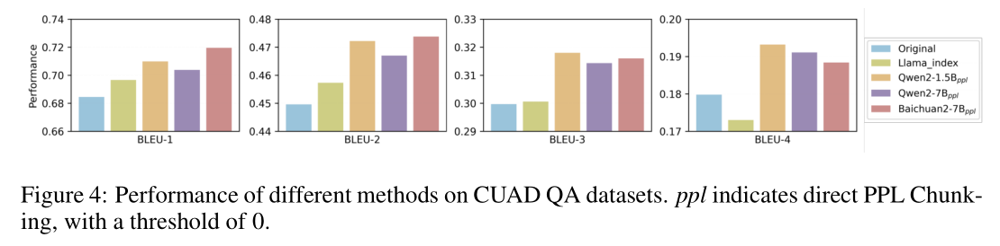

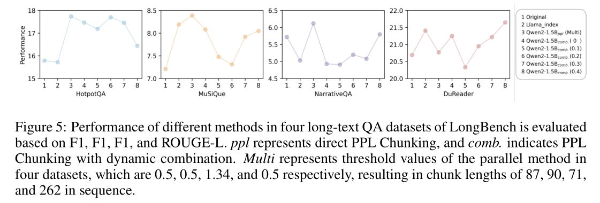

**分块方法对重排序性能的探索**

**PPL 分块和 PPLRerank 在所有指标上实现了最佳的整体性能**。与传统分块相比，PPL 分块不仅独立提供了性能增益，还显著增强了后续重排序的效果。在 Hits\@8 指标中，原始分块下的 PPLRerank 实现了 1.42% 的改进，而 PPL 分块下的 PPLRerank 则实现了 3.59% 的改进。

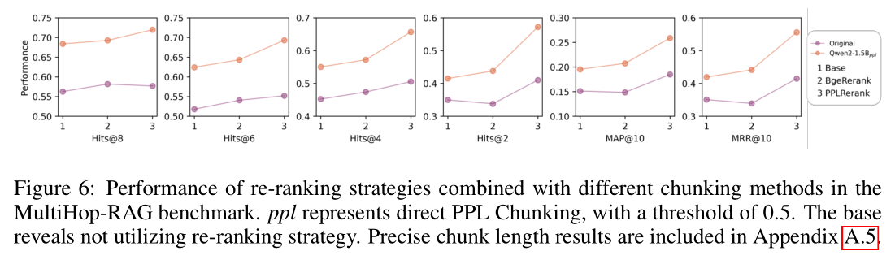

## 总结

**意义**：

**难点**：

**本文的思考**：
